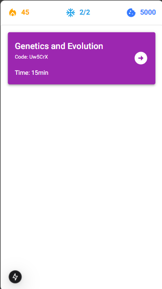
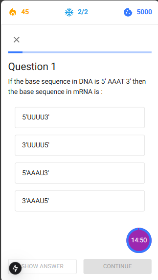
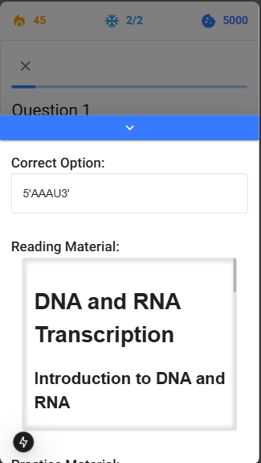
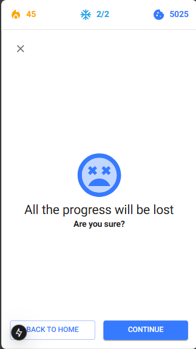
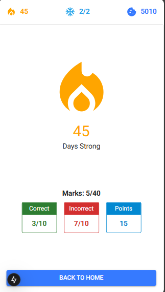

Testline Task.

## Getting Started

### Development server:

`1.` Clone the repository

```bash
git clone https://github.com/krishnav0110/testline.git
```

`2.` Install npm packages

```bash
npm i
# or
npm install
```

`3.` Start development server

```bash
npm run dev
```

`4.` Open [http://localhost:3000](http://localhost:3000) with your browser to see the result.

## Demo

### Pics:







### Video:

[Quiz Video Demo](.github/demo.mp4)
